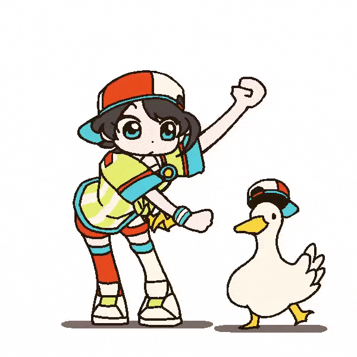

<p align="center">
  
</p>
<h1 align="center">Shuba Duck <i>- a Plasma splash screen</i></h1>

## Installation

### Get the files

Download the [latest release](https://github.com/sector1209/ShubaDuck-kde-splash/releases/latest)

**OR**

Clone this repo
```bash
git clone https://github.com/sector1209/ShubaDuck-kde-splash.git
cd ShubaDuck-kde-splash
```

### Install the splash screen

Install with `kpackagetool6`
```bash
# Run from the repo or extracted release directory
kpackagetool6 --type Plasma/LookAndFeel --install ./sector1209.ShubaDuck
```

**OR**

Copy the `sector1209.ShubaDuck` directory to `~/.local/share/plasma/look-and-feel/`
```bash
cp -r sector1209.ShubaDuck ~/.local/share/plasma/look-and-feel/
```

Enable at `System Settings > Colors & Themes > Splash Screen`

## Updating

Download the [latest release](https://github.com/sector1209/ShubaDuck-kde-splash/releases/latest)

**OR**

Pull the repo if you already have a local copy
```bash
# In the repo directory
git pull
```

Upgrade installation with `kpackagetool6`
```bash
# Run from the repo or extracted release directory
kpackagetool6 --type Plasma/LookAndFeel --upgrade ./sector1209.ShubaDuck
```

If you installed with `cp`, copy over the new folder as above
```bash
rm -rf ~/.local/share/plasma/look-and-feel/sector1209.ShubaDuck
cp -r sector1209.ShubaDuck ~/.local/share/plasma/look-and-feel/
```

## Uninstall

Uninstall at `System Settings > Colors & Themes > Splash Screen`

**OR**

```bash
kpackagetool6 --type Plasma/LookAndFeel --remove sector1209.ShubaDuck
```

## Acknowledgments

- Thanks to [@KS_wktk](https://x.com/KS_wktk) for the [original animation](https://x.com/KS_wktk/status/1370702788624142336)
- Thanks to [A2N](https://github.com/bouteillerAlan) for the [Kuro splash screen](https://github.com/bouteillerAlan/kuro) which inspired me to make this one

## License

The code in this repository is licensed under the [GPL-3.0-or-later](LICENSE).
The animation (`ShubaDuck.gif`) is the work of [@KS_wktk](https://x.com/KS_wktk)
and is not covered by this license.
